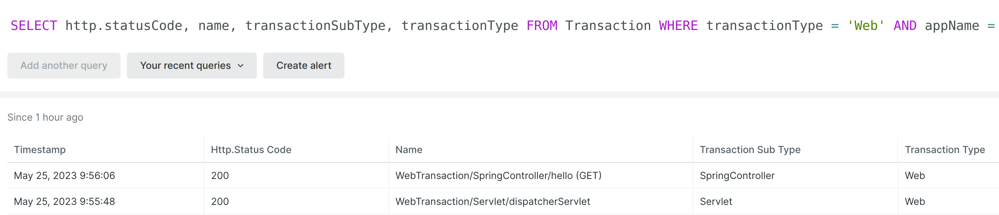

### Overview

This is a simple project showing the inconsistency in transaction names given by `newrelic-java-agent`, depending on
Spring Boot major version and Spring Cloud OpenFeign's `@EnableFeignClients` annotation.

### Steps to reproduce

1. Configure New Relic Java Agent 8.0.1 as per instructions at https://docs.newrelic.com/install/java/ (`newrelic.yml` used
   for tests can be found in `src/main/resources` - it has not been modified apart from `app_name`, `license_key`
   and `log_level`).
2. Run `./gradlew clean bootJar`
3. Run `java -javaagent:/full/path/to/newrelic.jar -jar build/libs/demo-0.0.1-SNAPSHOT.jar` (JDK used in tests: OpenJDK Temurin-17.0.6+10 x64)
4. Access the endpoint at `http://localhost:8080/hello` - e.g. `curl http://localhost:8080/hello`.
5. Check the transaction name of the request at `https://one.newrelic.com/data-exploration`,
   e.g. `SELECT appName, http.statusCode, name, transactionSubType, transactionType FROM Transaction WHERE transactionType = 'Web' AND appName = 'myapptest'`:
    * it will be `WebTransaction/Servlet/dispatcherServlet` (**unexpected** - this is because there is
      annotation `@EnableFeignClients(basePackageClasses = TestClient.class)`
      in `src/main/java/com/example/demo/DemoApplication.java`)

6. Change the annotation in `src/main/java/com/example/demo/DemoApplication.java` file
   to `@EnableFeignClients(basePackages = "com.example.demo")` and run steps 2-5 again:
    * it will be `WebTransaction/SpringController/hello (GET)` (**expected**)

7. Restore the annotation to `@EnableFeignClients(basePackageClasses = TestClient.class)`, downgrade Spring Boot and Spring Cloud in `build.gradle`:
    ```
    plugins {
        ...
        id 'org.springframework.boot' version '2.7.10'
        ...
    }
    ...
    dependencyManagement {
        imports {
            mavenBom "org.springframework.cloud:spring-cloud-dependencies:2021.0.6"
        }
    }
    ...
    ```
   and run steps 2-5 again:
    * it will be `WebTransaction/SpringController/TestController/sayHello` (**unexpected** - why different
      than `WebTransaction/SpringController/hello (GET)`?)

### Results screenshot and summary

The following screenshot presents the results at `one.newrelic.com` (all entries are from the same application and the
same `GET /hello` request, but with various libraries versions and `@EnableFeignClients` parameters):



The following table provides a summary for the tested cases:

| Spring Boot | Spring Cloud / OpenFeign |  Annotation                                                                                                        | Transaction name at one.newrelic.com                    | Expected? |
|-------------|-------------------------------|-------------------------------------------------------------------------------------------------------------------|---------------------------------------------------------|---------|
| 2.7.10      | 2021.0.6 / 3.1.6     | none or `@EnableFeignClients(basePackages = "com.example.demo")`                                                  | WebTransaction/SpringController/hello (GET)             | :heavy_check_mark: Y |
| 2.7.10      | 2021.0.6 / 3.1.6     | `@EnableFeignClients(basePackageClasses = TestClient.class)` or `@EnableFeignClients(clients = TestClient.class)` | WebTransaction/SpringController/TestController/sayHello | :warning: N (not sure why changed?) |
| 3.0.5       | 2022.0.2 / 4.0.2     | none or `@EnableFeignClients(basePackages = "com.example.demo")`                                                  | WebTransaction/SpringController/hello (GET)             | :heavy_check_mark: Y |
| 3.0.5       | 2022.0.2 / 4.0.2     | `@EnableFeignClients(basePackageClasses = TestClient.class)` or `@EnableFeignClients(clients = TestClient.class)` | WebTransaction/Servlet/dispatcherServlet                | :x: N (does not have required information) |

### New Relic Agent log entries

The following entries were observed in `newrelic_agent.log`:

* When the generated transaction name is `WebTransaction/SpringController/hello (GET)`:

```
com.newrelic FINE: com.newrelic.instrumentation.spring-4.3.0: weaved target jdk.internal.loader.ClassLoaders$AppClassLoader@251a69d7-com/example/demo/TestController
com.newrelic FINE: 	com/nr/agent/instrumentation/SpringController_Instrumentation.sayHello:()Ljava/lang/String;
com.newrelic FINE: 	com/nr/agent/instrumentation/SpringController_Instrumentation.sayHello:()Ljava/lang/String;
```

* When the generated transaction name is `WebTransaction/SpringController/TestController/sayHello`:

```
com.newrelic FINEST: Skipping instrumentation module com.newrelic.instrumentation.spring-4.3.0. The most likely cause is that com.newrelic.instrumentation.spring-4.3.0 shouldn't apply to this application.
...
com.newrelic FINER: Setting transaction name to "/TestController/sayHello" using Spring controller
com.newrelic FINEST: Setting transaction name to "/TestController/sayHello" for transaction com.newrelic.agent.Transaction@80c7de4 using LEGACY scheme
```

* When the generated transaction name is `WebTransaction/Servlet/dispatcherServlet` (in this case there are no lines
  containing `TestController`):

```
com.newrelic FINEST: Skipping instrumentation module com.newrelic.instrumentation.spring-4.3.0. The most likely cause is that com.newrelic.instrumentation.spring-4.3.0 shouldn't apply to this application.
```